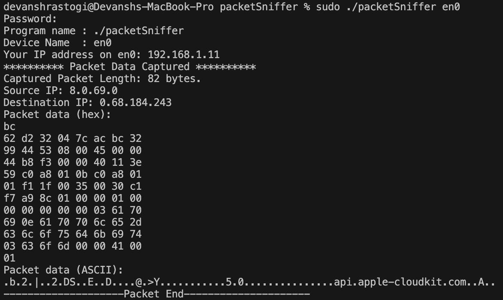

# packetSniffer

> [!NOTE]  
> packetReader.cpp is written for macOS and can only read packet data; no analysis functionality yet!

## Description
A very basic Packet Sniffer program written in C++ using the PCAP library to capture and print out packet data in HEX and ASCII format. It should be noted that it is **not** analysing packet data as of now.

## Usage
To compile the program, we need to specify that we are going to be using an external library *pcap* along with the command that is normally used to compile a cpp program.

```console
g++ packetReader.cpp -o packetSniffer -lpcap
```

Through this way, we told the compiler to pickup functionality from *pcap* library

Next, to execute the code, we need to have administrator access because you'd be interacting with the low-level controllers of your machine thorugh *sudo* command. Apart from this, you will need to specify the interface number you wanna listen to. We'll be listening to en0. And we'll specify this when we'd be executing packetSniffer Unix executable.

```console
sudo ./packetSniffer en0
```

## Which Interface to Listen To?
Type the following command in mac terminal to get a list of all available interfaces: -

```console
ifconfig
```

## The End Result 

A packet caught!

<center>
    
</center>

## Plans
* To implement packet analysis.
* To implement GUI.

## Source
The code has been written using [this](https://www.youtube.com/watch?v=qm6dUDO4SjQ) video as a guide and sourced from [this](https://github.com/PolyBitz-Official/demoPacketSniffer) repository.